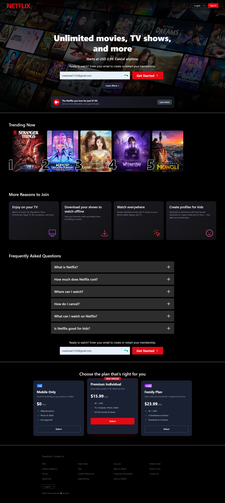

# Netflix Clone Landing Page

- **Name:** Phon Ramy
- **Project:** Netflex Clone Landing Page
- **Description:** A responsive landing page clone of Netflix built using HTML and Tailwind CSS. This project showcases various sections including a hero section, trending movies, pricing plans, FAQs, and testimonials.

published on: [Netflex Clone Live Demo](https://netflix-clone-ramy.vercel.app/)

## screenshots

## Technologies Used
- HTML5
- Tailwind CSS
- JavaScript (for interactivity)

## Implemented Features
- **Responsive Design:** Fully responsive layout for mobile, tablet, and desktop.
- **Hero Section:** Cinematic background with gradient overlays and call-to-action buttons.
- **Trending Now:** Horizontal scroll/grid of trending movies with rank numbers.
- **More Reasons to Join:** Feature cards using CSS Grid with custom gradients.
- **Pricing Section:** Three tier pricing plan display.
- **FAQ Section:** Interactive accordion for frequently asked questions.
- **Testimonials:** Carousel displaying user feedback.
- **Footer:** Comprehensive navigation links and settings.

## Credits
- **Icons:** Custom SVGs inspired by Netflix UI.
- **Font:** Inter / Sans-serif system fonts.

## How to Run Locally

1.  **Clone the repository**
    ```bash
    git clone https://github.com/remy2404/netflex_clone.git
2.  **Install dependencies:**
    ```bash
    npm install
    ```
3.  **Start the development server:**
    ```bash
    npm run dev
    ```
4.  Open your browser and navigate to the local URL provided (usually `http://localhost:5173`).
